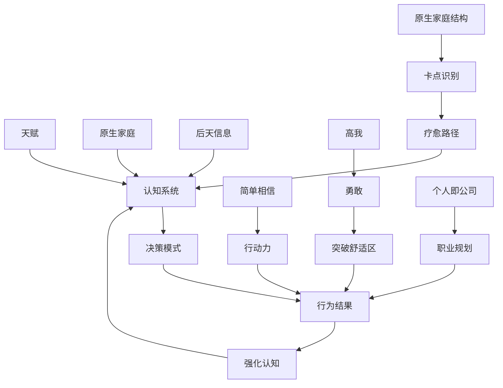

# Domain Model - 领域模型

## 核心领域对象

### 1. 认知系统（Cognitive System）

**已确认事实**:

```
认知 = 天赋 × 原生家庭 × 后天信息输入
```

**属性**:
- `操作系统`: 思维框架和逻辑结构
- `信息过滤器`: 决定接受什么、拒绝什么
- `价值观`: 判断对错、好坏的标准
- `世界观`: 对世界的整体认知
- `信念体系`: 深层假设和预设

**状态**:
- 默认状态：受原生家庭和社会信息塑造，存在偏差
- 可重构状态：通过刻意练习和新信息输入升级

**关键方法**:
- `识别偏差`: 觉察自己的认知盲区
- `清空旧系统`: 承认旧认知的局限性
- `植入新信息`: 选择高质量信息源
- `实践验证`: 在真实场景中检验新认知
- `内化为习惯`: 形成新的自动反应模式

**来源**: career_design_meta_knowledge/2.0-认知os

---

### 2. 简单相信能力（Simple Trust）

**已确认事实**:

定义：抛开先入为主的观念，直接认同并采纳他人建议的能力

**属性**:
- `认知门槛`: 需要足够的认知水平判断对方是否可信
- `心力`: 执行层面的动力
- `策略性`: 即使不相信，也可假装相信去行动

**状态**:
- 常态：难以实现，受原生家庭和过往经历影响
- 习得状态：通过实践可以培养

**关键方法**:
- `判断可信度`: 对方是否成功？是否有害我动机？
- `降低预期`: 即使失败也不损失什么
- `行动优先`: 先做再验证，而非先验证再做

**来源**: career_design_meta_knowledge/2.0-认知os 第00:00-06:08

---

### 3. 原生家庭结构（Origin Family Structure）

**已确认事实**（萨提亚模式）:

#### 3.1 人员结构
```
[爸爸] - [妈妈]
    \   /
   [我] + [兄弟姐妹]（如有）
```

**属性**:
- `角色`: 性别（男/女）、长幼顺序
- `基本信息`: 年龄、职业、文化程度
- `状态`: 在世/去世

#### 3.2 关系结构（四种关系线）

| 线条类型 | 语义 | 代码符号 |
|---------|------|---------|
| 粗实线 | 亲密（可能过度亲密） | `━━━` |
| 单实线 | 关系一般 | `───` |
| 虚线 | 疏离/回避/拒绝 | `╌╌╌` |
| 波浪线 | 冲突/矛盾 | `〰️` |

**三角关系**:
- 我↔妈妈
- 我↔爸爸
- 妈妈↔爸爸

#### 3.3 主观认知结构

每个人用3-6个词汇形容：
- 3个正向词汇
- 3个负向词汇

**用途**: 揭示原生家庭对个体的影响模式

**来源**: Satir family therapy model/01-王剑飞萨提亚家庭治疗课.md

---

### 4. 个人即公司（Personal as Company）

**已确认事实**（战略框架）:

```
┌─────────────────────────────────────┐
│  个人职业规划 = 企业经营战略          │
├─────────────────────────────────────┤
│  Q1: 我卖什么？（产品/服务）          │
│  Q2: 客户是谁？（目标雇主）           │
│  Q3: 为什么买我？（竞争优势）         │
│  Q4: 如何让别人知道我？（渠道）       │
│  Q5: 战略目标是什么？（3-5年愿景）    │
│  Q6: 需要什么资源？（时间/人脉/学历） │
└─────────────────────────────────────┘
```

**类比映射**:
| 企业 | 个人 |
|------|------|
| 产品/服务 | 时间 + 专业技能 |
| 客户 | 雇主/目标公司 |
| 竞争优势 | 相对优势（比别人强在哪） |
| 市场营销 | 简历、面试、内推、个人品牌 |
| 渠道 | 招聘网站、猎头、校友会 |
| 战略目标 | 年薪百万、成为专家、财务自由 |
| 资源需求 | 学历、证书、大厂经历、人脉 |

**案例**:
- 3W咖啡：品质+外国人多显得专业 → 吸引留学生/老师
- 蜜雪冰城：便宜+密集开店 → 价格敏感人群

**来源**: commercial&&career/许单单谈像开公司一样经营自己的职场发展.md

---

### 5. 1.01复利法则（1.01 Compound Rule）

**已确认事实**:

```
1.01^365 = 37.8（一年后是现在的37.8倍）
0.99^365 = 0.03（一年后只剩3%）
```

**应用场景**:
- 每天进步1%
- 每天退步1%
- 适用于技能、财富、关系等所有领域

**来源**: career_design_meta_knowledge/4.0-许单单的弟弟-初中毕业pony的1.01_3.md

---

### 6. 高我 vs 小我（Higher Self vs Lower Self）

**已确认事实**（冥想修行）:

#### 高我（Higher Self）
- 属性：智慧、冷静、有力量
- 视角：能客观观察小我
- 决策依据：什么是对的、重要的
- 状态：与灵魂、本心连接

#### 小我（Lower Self）
- 属性：恐惧、焦虑、贪婪
- 视角：自我保护，避免风险
- 决策依据：什么是安全的、不被批评的
- 状态：受原生家庭创伤驱动

**关键洞察**:
- 勇敢 = 高我升起，克服小我的恐惧
- 爱自己 = 认为自己重要，不委屈自己
- 工具人陷阱 = 忘记高我，只以小我行动

**来源**: meditation&&Metacognition/许单单谈冥想身心灵疗愈&&勇敢.md

---

### 7. 职业阶段模型（Career Stage Model）

**已确认事实**:

#### 30岁前
- 特征：能力差异不明显
- 竞争维度：勤奋度、学习速度

#### 33-34岁
- 特征：开始明显分化
- 竞争维度：能力突破、不可替代性

#### 35岁+
- 分岔路A（低风险）: 无显著能力突破
  - 结果：体力下降、家庭琐事增多
  - 竞争劣势：不如30岁年轻人拼命、便宜
  - 结局：职业天花板、裁员风险

- 分岔路B（高风险高回报）: 能力显著突破
  - 结果：能力远超30岁人群
  - 竞争优势：稀缺、不可替代
  - 结局：极其值钱（如"甘家伟"案例）

**来源**: origin_family/许单单-我们曾相信，活着就要改变世界

---

### 8. 信息茧房（Information Cocoon）

**已确认事实**:

```
社会阶层固化 = 信息茧房 × 认知局限
```

**机制**:
1. 不同阶层接触不同信息
2. 信息塑造认知
3. 认知决定行为
4. 行为强化阶层

**破局方法**:
- 主动接触高认知人群
- 付费获取高质量信息
- 旅行、跨界交流
- 阅读经典、与高人对话

**来源**: career_design_meta_knowledge/2.0-认知os

---

### 9. 负能量PUA（Negative Energy Manipulation）

**已确认事实**:

定义：通过持续输入负面信息，操纵个体情绪和认知

**常见形式**:
- 网络负面新闻轰炸
- "出身论"、"运气论"等宿命论调
- 制造焦虑（35岁危机、学历歧视）
- 对立情绪（男女对立、阶层对立）

**识别方法**:
- 是否让人感到无力、绝望？
- 是否强化"我不行"的信念？
- 是否阻止你行动？

**应对**:
- 主动屏蔽
- 用积极信息对冲
- 聚焦可控因素

**来源**: career_design_meta_knowledge/2.0-认知os 第49-56分钟

---

## 领域关系图



## 待补充领域对象

- [ ] 贵人网络（第10讲内容，未读取）
- [ ] 绩效显性/隐性理论（第8讲内容，已存在但未详细分析）
- [ ] 换位思考方法论（第6、7讲）
- [ ] 长期主义实践路径（第10讲）
- [ ] 正负循环模型（第6讲）

## 领域边界

**已确认事实**:
- 本知识库聚焦个人成长，不涉及企业管理具体操作
- 冥想内容偏重哲学层面，非技术性冥想指导
- 不包含医学/心理学诊断，仅为个人经验分享

**高概率推断**:
- 受众为成年人（非青少年）
- 不涉及宗教，属于身心灵范畴
- 商业思考基于中国互联网行业背景
