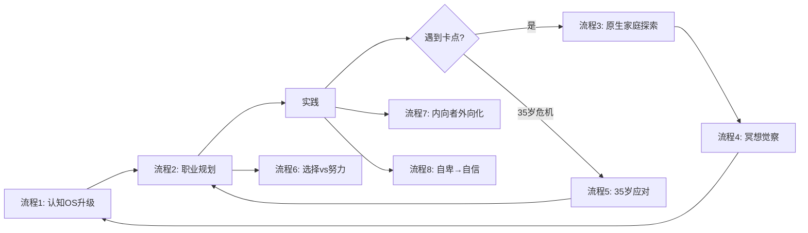

# 流程索引（Flow Index）

## 核心流程总览

本项目为知识库，无代码执行流程，但存在**知识传递和应用流程**。

---

## 流程1: 认知操作系统升级流程

**已确认事实**

### 流程步骤
```
1. 识别错误认知
   ↓
2. 清空旧操作系统
   ↓
3. 植入高质量新信息
   ↓
4. 实践验证
   ↓
5. 反馈循环
   ↓
6. 内化为新习惯（新OS形成）
```

### 详细说明

#### Step 1: 识别错误认知
- **方法**: 觉察"我不行"的声音、观察反复失败的领域
- **来源**: 原生家庭、社会规训、负面信息
- **输出**: 列出3-5个限制性信念

#### Step 2: 清空旧系统
- **方法**: 承认旧认知的局限性，不自我辩护
- **难点**: ego（自我）会抵抗
- **技巧**: 冥想观察小我

#### Step 3: 植入新信息
- **信息源**:
  - 成功人士的第一手经验
  - 经典书籍
  - 高质量课程
  - 跨界交流
- **筛选标准**: 对方是否有真正成功？是否有害我动机？

#### Step 4: 实践验证
- **方法**: 小成本试错
- **关键**: 行动优先于完美准备

#### Step 5: 反馈循环
- **复盘**: 什么有效？什么无效？
- **调整**: 根据结果修正认知

#### Step 6: 内化为习惯
- **标志**: 不需要刻意提醒就能执行
- **时间**: 21-66天（因行为复杂度而异）

**来源**: career_design_meta_knowledge/2.0-认知os 第25-56分钟

**证据级别**: 已确认事实

---

## 流程2: 个人职业规划流程（五步法）

**已确认事实**

### 流程步骤
```
1. 产品定位: 我卖什么？
   ↓
2. 客户定位: 卖给谁？
   ↓
3. 竞争优势: 为什么买我？
   ↓
4. 渠道策略: 如何让别人知道我？
   ↓
5. 目标与资源: 阶段性目标 + 所需资源
```

### 详细说明

#### Step 1: 产品定位
- **个人即公司**: 你的产品是你的时间 + 专业技能
- **本质**: 不是卖"产品经理"，而是卖"帮企业做出好产品"的服务

#### Step 2: 客户定位
- **聚焦**: 选择一个最优先的目标客户群
- **放弃**: 明确放弃哪些客户
- **例子**:
  - 3W咖啡：放弃普通学生，聚焦有钱人（留学生、老师、富二代学生）
  - 蜜雪冰城：放弃追求健康的人群，聚焦价格敏感人群

#### Step 3: 竞争优势
- **相对优势**: 比别人强在哪？
- **差异化**: 不是某个单点，而是整体组合
- **例子**:
  - 3W咖啡：品质好 + 外国人多显得专业 + 英文菜单
  - 蜜雪冰城：便宜 + 密集开店 + 标准化装修

#### Step 4: 渠道策略
- **企业**: 市场部、品牌建设、KOL合作
- **个人**: 简历优化、面试辅导、内推、个人品牌
- **关键**: 酒香也怕巷子深

#### Step 5: 目标与资源
- **战略目标**: 3-5年愿景（如年薪百万）
- **阶段性目标**: 拆解到年/季度/月
- **资源盘点**:
  - 已有：学历、经验、人脉
  - 需要：证书、大厂经历、推荐人

**来源**: commercial&&career/许单单谈像开公司一样经营自己的职场发展.md

**证据级别**: 已确认事实

---

## 流程3: 原生家庭探索与疗愈流程

**已确认事实**（萨提亚模式）

### 流程步骤
```
1. 绘制原生家庭图
   ├── 人员结构
   ├── 关系结构
   └── 认知结构
   ↓
2. 小组讨论（分享与觉察）
   ↓
3. 识别卡点
   ↓
4. 实践训练（暴露卡点）
   ↓
5. 疗愈与整合
```

### 详细说明

#### Step 1: 绘制原生家庭图
**人员结构**:
- 画等圆代表每个人（体现平等）
- 方框=男性，圆圈=女性，五角星=自己
- 标注：年龄、职业、文化程度
- 去世者画叉

**关系结构**:
- 画出"我↔妈妈"、"我↔爸爸"、"妈妈↔爸爸"
- 四种线条：
  - 粗实线=亲密
  - 单实线=一般
  - 虚线=疏离
  - 波浪线=冲突

**认知结构**:
- 每人3-6个形容词（3正+3负）
- 写不出也没关系，这本身就反映影响

#### Step 2: 小组讨论
- 分组：每组6人（模拟家庭）
- 时长：30分钟
- 内容：
  1. 根据关系线分享与妈妈的关系
  2. 分享妈妈的形容词
  3. 探讨"我"与妈妈的关联

#### Step 3: 识别卡点
- 觉察：我在职场/关系中的卡点是什么？
- 关联：这些卡点与原生家庭的什么模式有关？
- 举例：
  - 不敢争取领导岗位 → 小时候不被关注
  - 害怕冲突 → 父母经常争吵

#### Step 4: 实践训练（选组长）
- 每人竞选组长发言
- 觉察：是否期待被看见？发言时关注什么？
- 投票：赞成/反对/弃权
- 公开唱票
- 觉察：投票时的情绪、与职场竞争的关联

#### Step 5: 疗愈与整合
- 看见卡点即疗愈的开始
- 理解父母局限性（他们也受原生家庭影响）
- 课题分离：父母的命运≠我的命运

**来源**: Satir family therapy model/01-王剑飞萨提亚家庭治疗课.md

**证据级别**: 已确认事实

---

## 流程4: 冥想修行流程（三层境界）

**高概率推断**

### 流程步骤
```
第一层：觉察（Meditation）
   ↓
第二层：理解（Understanding）
   ↓
第三层：整合（Integration）
```

### 详细说明

#### 第一层：觉察
- **方法**: 冥想练习
- **能力**: 观察小我（情绪、恐惧、贪婪）而不被带走
- **标志**: 能在情绪升起时看到它，而非立即反应

#### 第二层：理解
- **对象**: 小我背后的原因
- **溯源**: 这些情绪来自哪里？（通常是原生家庭）
- **洞察**: 理解父母局限性，理解自己模式的形成

#### 第三层：整合
- **方法**: 高我主导，小我辅助
- **状态**:
  - 不委屈自己（爱自己）
  - 勇敢做该做的事
  - 既享受人生酸甜苦辣，又不害怕
  - 既鲜活，又有力量

**核心公式**:
```
勇敢 = 爱自己 = 高我升起 = 做真正该做的事
```

**来源**: meditation&&Metacognition/许单单谈冥想身心灵疗愈&&勇敢.md

**证据级别**: 已确认事实（核心观点） + 高概率推断（分层描述）

---

## 流程5: 35岁职业危机应对流程

**已确认事实**

### 流程步骤
```
33岁预警 → 诊断能力差距 → 补短板 or 转岗 → 能力突破 → 稀缺化
```

### 详细说明

#### Step 1: 33岁预警
- **信号**:
  - 晋升无望（在边缘部门做leader）
  - 行业下行（如房地产、金融裁员）
  - 技能单一，容易被替代

#### Step 2: 诊断能力差距
- **关键问题**: 我与30岁的人相比，有明显的能力差异吗？
- **评估维度**:
  - 专业技能深度
  - 管理能力（如有）
  - 行业认知
  - 资源网络
  - 不可替代性

#### Step 3: 补短板 or 转岗
**选项A: 补短板**
- 适合：核心能力仍有提升空间
- 行动：
  - 深度学习（读经典、上课）
  - 刻意练习（做高难度项目）
  - 寻求导师

**选项B: 转岗**
- 适合：当前岗位已触顶
- 行动：
  - 转向核心部门（如从测试→开发）
  - 跨界（如从技术→产品）
  - 换行业（如从房地产→互联网）

**关键洞察**:
- 35岁前是最后的机会
- 36-37岁公司不会再给你成长机会

#### Step 4: 能力突破
- **标志**: 能力远超30岁人群
- **例子**: 甘家伟级人物（花多少钱都值得请）

#### Step 5: 稀缺化
- **结果**: 成为不可替代的人
- **状态**: 极其值钱

**来源**: origin_family/许单单-我们曾相信，活着就要改变世界

**证据级别**: 已确认事实

---

## 流程6: 选择 vs 努力再平衡流程

**已确认事实**

### 流程步骤
```
找工作阶段（投入资源）
   ↓
选择好工作（Offer谈判）
   ↓
工作阶段（努力工作）
   ↓
验证选择质量
```

### 关键洞察

**误区**:
- 找工作不认真（随便海投）
- 工作很努力（加班996）
- 结果：本末倒置

**正确做法**:
```
找工作 = 全职工作
- 优化简历（花钱请人改）
- 提升面试技巧（付费培训）
- 广泛内推（动用所有人脉）
- 目标：找到好工作，而非"找到工作"
```

**资源投入对比**:

| 阶段 | 普通人 | 富人/高认知者 |
|------|--------|--------------|
| 找工作 | 自己瞎投，1-2周随便接offer | 投入3-6个月，求助导师、猎头、内推 |
| 工作 | 996加班，感动自己 | 选择大于努力，因选择好而事半功倍 |

**心理安全网**:
- 有人告诉你："你3-6个月找到好工作是正常的"
- 敢于等待更好的机会
- 不会因焦虑而接受低质量offer

**来源**: origin_family/许单单-我的"穷人思维"，耽误了妹妹十年.md

**证据级别**: 已确认事实

---

## 流程7: 内向者外向化流程

**高概率推断**

### 流程步骤
```
识别内向 → 决定改变 → 刻意练习 → 角色扮演 → 成为习惯 → 选择性回归
```

### 详细说明

#### Step 1: 识别内向
- 社交消耗能量
- 喜欢独处
- 不擅长寒暄

#### Step 2: 决定改变
- **触发**: 意识到内向在社会竞争中处于劣势
- **心态**: 这是为成功付出的代价

#### Step 3: 刻意练习
- **具体行动**:
  - 练习说脏话（"我靠"、"牛逼"）
  - 强迫自己打招呼
  - 进门前深呼吸，调整状态

#### Step 4: 角色扮演
- **初期**: 非常累，每次社交后需要恢复
- **技巧**: 记住人名（为获取资源而记）

#### Step 5: 成为习惯
- 重复多次后自然流露
- 不再需要刻意扮演

#### Step 6: 选择性回归
- **条件**: 已达成目标，不再需要社交
- **结果**: 回归舒适状态，专注真正重要的事

**关键洞察**:
- 外向是技能，不是性格
- 是否需要长期保持外向，取决于目标

**来源**: origin_family/许单单-我的"穷人思维"，耽误了妹妹十年.md

**证据级别**: 高概率推断（基于个人经历）

---

## 流程8: 从自卑到自信转变流程

**已确认事实**

### 流程步骤
```
极度自卑 → 关键事件 → 认知颠覆 → 建立标杆 → 行动验证 → 自信形成
```

### 许单单案例

#### Step 1: 极度自卑
- 高中：低头走路，不敢看人
- 原因：农村贫困 + 同学捐款（觉得丢人）
- 状态：极度自卑

#### Step 2: 关键事件
- **事件**: 大一参观女同学家
- **刺激**:
  - 看到300平米大房子
  - 了解同学父亲：军队勤务员 → 军校 → 下海创业
  - 发现：努力+优秀可以在短时间内改变命运

#### Step 3: 认知颠覆
- **旧认知**: 我比不上城市同学
- **新认知**: 他爸爸做到的，我也可以
- **关键**: 从羡慕转变为"我也不比他爸爸差"

#### Step 4: 建立标杆
- **标杆**: 同学父亲的成长路径
- **信念**: 我也可以做到

#### Step 5: 行动验证
- **行动**: 大一暑假开始做家教
- **反馈**: 能赚钱 + 能力被认可

#### Step 6: 自信形成
- **结果**: 整个人改变，开始积极发展
- **标志**: 不再羡慕城市同学

**来源**: origin_family/许单单2021年关于原生家庭和成长经历的公开采访.md

**证据级别**: 已确认事实

---

## 流程依赖图



## 流程变更频率

| 流程 | 稳定性 | 理由 | 热区等级 |
|------|--------|------|----------|
| 流程1（认知升级） | 高 | 理论基础，变化少 | 🟢 |
| 流程2（职业规划） | 高 | 五步法框架稳定 | 🟢 |
| 流程3（原生家庭） | 中 | 案例会更新，流程稳定 | 🟡 |
| 流程4（冥想） | 中 | 哲学框架稳定，表述可能优化 | 🟡 |
| 流程5（35岁应对） | 高 | 逻辑清晰，变化少 | 🟢 |
| 流程6（选择vs努力） | 高 | 核心洞察稳定 | 🟢 |
| 流程7（内向外向） | 中 | 个人经验，可能补充案例 | 🟡 |
| 流程8（自卑自信） | 高 | 个人史，固定 | 🟢 |

## 待补充流程

- [ ] 1.01法则的实践流程（如何每天进步1%）
- [ ] 换位思考的具体操作步骤（第6讲）
- [ ] 寻找贵人的方法论（第10讲）
- [ ] 长期主义的时间规划方法（第10讲）
- [ ] 正负循环的建立与打破（第6讲）

## 流程复用建议

**当用户提问时**:
1. 先判断属于哪个流程（如"职业规划"→ 流程2）
2. 直接提供流程步骤
3. 根据用户具体情况调整
4. 引用相关文档作为证据

**示例**:
```
用户: "我现在35岁，感觉晋升无望"
→ 触发: 流程5（35岁危机应对）
→ 提供: Step 1诊断 → Step 2评估 → Step 3决策
→ 引用: origin_family/许单单-我们曾相信...md
```
